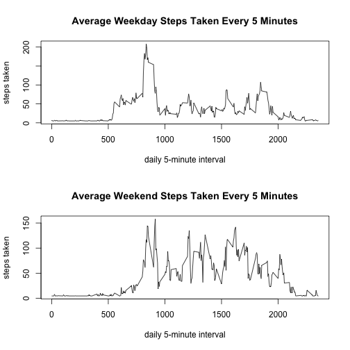

The data for this assignment was downloaded from the <link provided in the assignment>[link](https://d396qusza40orc.cloudfront.net/repdata%2Fdata%2Factivity.zip) into the working directory for processing with the following R code.

The data were read into the working directory for processing.  

```r
ActMon <- read.csv("activity.csv")
```

The total number of steps taken per day were calculated and plotted as a histogram with 10 bins.

```r
steps.date <- tapply(ActMon$steps, ActMon$date, FUN = "sum")
hist(steps.date, breaks = 10,
     xlab = "steps per day",
     main = "Frequency of Daily Step Count")
```


The mean and median steps per day were calculated as: mean = 10766.19, median =10765.

Averaging steps per 5-minute interval across all days was plotted to view average activity across the day.

```r
steps.int <- tapply(ActMon$steps, ActMon$interval, FUN = "mean", na.rm = TRUE)
ints <- unique(ActMon$interval)
plot(ints, steps.int, type = "l",
     xlab = "daily 5-minute interval",
     ylab = "steps taken",
     main = "Average Steps Taken Every 5 Minutes")
```


The interval with the highest number of steps was identified as 104, which translates to mean interval #104 that occurred between 8:35 - 8:40am.

The number of missing values in the data was calculated as 2304, which represented 13.1 percent of the total data.

Missing values were imputed using the mean value for the interval across all days without missing values for that interval and added into a replicate data set.

```r
library(dplyr)
ActMon2 <- ActMon
ActMon2 <- ActMon2 %>%
    group_by(interval) %>%
    mutate(steps=replace(steps, is.na(steps), mean(steps, na.rm=TRUE)))
```

Histograms showing the frequency of steps per day were regenerated with the imputed data.

```r
steps2.date <- tapply(ActMon2$steps, ActMon2$date, FUN = "sum")
hist(steps2.date, breaks = 10,
     xlab = "steps per day",
     main = "Frequency of Daily Step Count")
```


The mean and median were recalculated after imputing the missing data as: mean = 10766.19, median = 10766.19

As expected, there was no change in the mean, since the mean of the intervals was used to impute the new values, and there was a small change in the median, since a fractional value was imputed into the data set.

For further analysis, days were identified as weekdays or weekend days with an additional factor column added to the data set

```r
## convert date column to POSITxt
library(lubridate)
library(plyr)
ActMon2$date <- ymd(ActMon2$date)
## add day factor
ActMon2$day.type <- as.factor(weekdays(ActMon2$date))
## convert days to weekday or weekend factors
ActMon2$day.type <- revalue(ActMon2$day.type, 
        c("Monday"="Weekday", "Tuesday"="Weekday", "Wednesday"="Weekday", 
        "Thursday"="Weekday", "Friday"="Weekday","Saturday"="Weekend","Sunday"="Weekend"))
```

The average steps per day were recalculated separately for weekdays and weekend days.

```r
ActMon.wkday <- subset(ActMon2, day.type=="Weekday")
ActMon.wkend <- subset(ActMon2, day.type=="Weekend")
## calculate average steps by interval for weekday and weekend separately
steps.wkday <- tapply(ActMon.wkday$steps, ActMon.wkday$interval, FUN = "mean")
steps.wkend <- tapply(ActMon.wkend$steps, ActMon.wkend$interval, FUN = "mean")
```

The step data by day type was replotted to view average daily activity across the 5-minute intervals separately by weekday and weekend day.

```r
par(mfrow=c(2,1))
plot(ints, steps.wkday, type = "l",
     xlab = "daily 5-minute interval",
     ylab = "steps taken",
     main = "Average Weekday Steps Taken Every 5 Minutes")
plot(ints, steps.wkend, type = "l",
     xlab = "daily 5-minute interval",
     ylab = "steps taken",
     main = "Average Weekend Steps Taken Every 5 Minutes")
```



These graphs show greater activity during mid-day time periods on the weekend then during weekdays for this individual.
